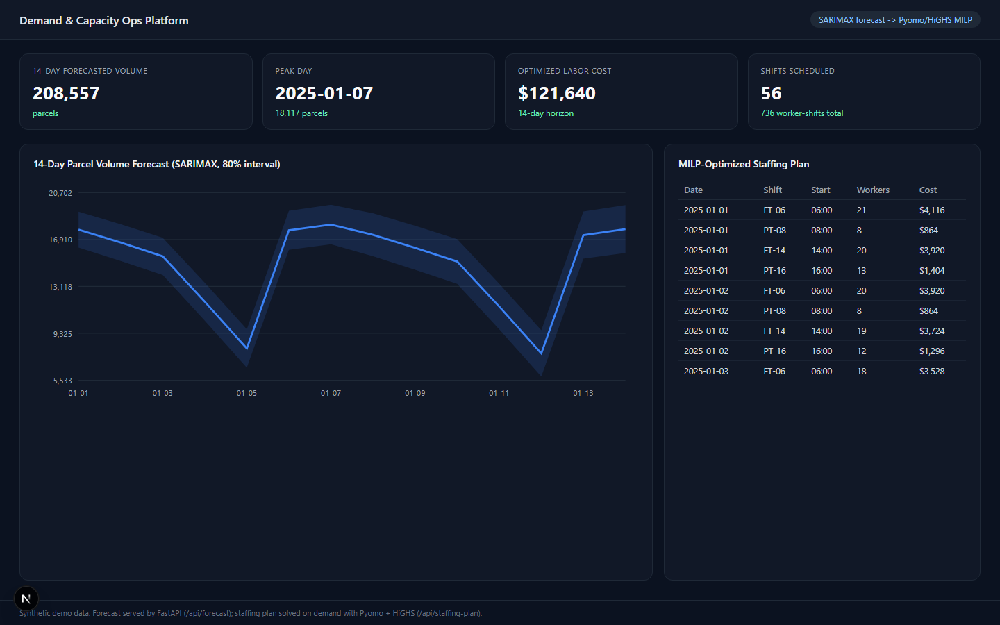
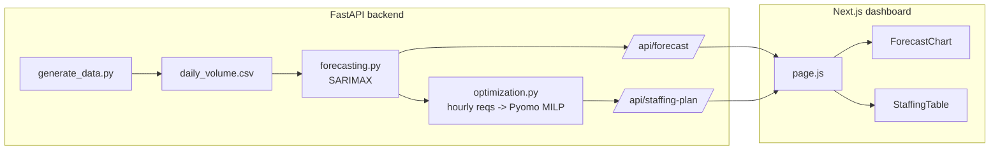

# Demand & Capacity Ops Platform

The "productionized" version of the two standalone repos in this
portfolio -- [`parcel-volume-forecasting`](../parcel-volume-forecasting)
and [`workforce-capacity-optimization`](../workforce-capacity-optimization)
-- wired into one live service with a real dashboard on top:

```
FastAPI backend  --  SARIMAX forecast  -->  Pyomo/HiGHS staffing MILP  -->  JSON API
                                                                                |
Next.js frontend  <-----------------------------------------------------------+
```

A demand planner opens one page and sees both the volume forecast for the
next two weeks *and* the minimum-cost staffing plan the optimizer derived
from it -- the same forecast-to-optimization pipeline described
conceptually in the other two repos' READMEs, actually running as a
service here.

> **Note on data:** `backend/data/generate_data.py` synthesizes ~3 years
> of daily parcel volume for a single distribution center (trend + weekly/
> annual seasonality + noise). No real operational data is used.

---

## Live dashboard



This is an actual screenshot of `npm run dev` (Next.js, Turbopack) talking
to a live `uvicorn` backend -- not a mockup. The KPI row, forecast chart,
and staffing table are all populated from the two API calls the page
makes on load: `GET /api/forecast` and `GET /api/staffing-plan`.

---

## Architecture



The frontend never talks to Spark, Pyomo, or statsmodels directly -- it
only knows about two JSON endpoints. That boundary is the point: it's what
lets the modeling team iterate on the forecasting/optimization logic
independently of whoever owns the dashboard.

---

## Repository layout

```
demand-ops-platform/
├── backend/
│   ├── app/
│   │   ├── main.py              # FastAPI app + /api routes
│   │   ├── forecasting.py       # SARIMAX forecast service
│   │   ├── optimization.py      # forecast -> hourly reqs -> MILP staffing plan
│   │   └── schemas.py           # pydantic response models
│   ├── data/generate_data.py    # synthetic daily volume history
│   ├── tests/test_api.py        # FastAPI TestClient tests
│   └── Dockerfile
├── frontend/
│   ├── app/page.js              # dashboard page (client component)
│   ├── components/
│   │   ├── ForecastChart.js     # dependency-free SVG line + band chart
│   │   └── StaffingTable.js
│   └── Dockerfile               # dev-mode (npm run dev) image
├── docker-compose.yml           # backend + frontend, one command
└── .github/workflows/ci.yml     # backend pytest + frontend build
```

---

## Quickstart

**Option 1 -- Docker Compose (recommended, runs both services):**
```bash
docker compose up --build
# backend:  http://localhost:8000/api/health
# frontend: http://localhost:3000
```

**Option 2 -- run locally:**
```bash
# Terminal 1 -- backend
cd backend
python -m venv .venv && source .venv/bin/activate
pip install -r requirements.txt
uvicorn app.main:app --reload

# Terminal 2 -- frontend
cd frontend
npm install
npm run dev
# open http://localhost:3000
```

Run the backend tests: `cd backend && pytest -v`

---

## API

| Endpoint | Description |
|---|---|
| `GET /api/health` | liveness check |
| `GET /api/forecast?horizon_days=14` | SARIMAX forecast + 80% interval |
| `GET /api/staffing-plan?horizon_days=14` | forecast-driven MILP staffing plan |

```bash
curl "http://localhost:8000/api/forecast?horizon_days=5"
curl "http://localhost:8000/api/staffing-plan?horizon_days=5"
```

---

## Design notes

- **Why SARIMAX and not Prophet here?** This service refits on every
  request, so the model needs to fit fast. SARIMAX fits in well under a
  second on ~3 years of daily data; Prophet's Stan backend is slower to
  fit repeatedly on demand. For a real deployment, the natural next step
  is to fit models offline on a schedule (see
  [`parcel-volume-forecasting`](../parcel-volume-forecasting) for the
  Prophet/SARIMAX comparison, and the MLflow registry pattern in
  [`sorter-anomaly-detection-pyspark`](../sorter-anomaly-detection-pyspark))
  and have the API simply serve the latest registered model's predictions.
- **Why a hand-rolled SVG chart instead of a charting library?** Keeps
  `npm install` to three packages (`next`, `react`, `react-dom`) for a demo
  repo. Swapping in Recharts/visx/Observable Plot is a contained change
  inside `ForecastChart.js` and would be the first thing to do before
  shipping this to real users.
- **The Next.js `rewrites()` config** in `next.config.js` proxies
  `/api/*` to the FastAPI backend (`BACKEND_URL`, defaulting to
  `localhost:8000` locally and `http://backend:8000` inside Docker
  Compose) so the browser only ever talks to one origin.
- **Dev-mode Docker image**: `frontend/Dockerfile` runs `npm run dev`
  intentionally (per this portfolio's goal of showing what a live
  development environment looks like end-to-end). A production image
  would run `next build && next start` behind a reverse proxy with
  proper caching headers instead.

---

## License

MIT -- see [LICENSE](LICENSE).


---


### Thank you for reading

#### Please consider giving a star if you find the repo useful. Thank you.

---

### **AUTHOR'S BACKGROUND**
### Author's Name:  Emmanuel Oyekanlu
```
Skillset:   I have experience spanning several years in data science, enterprise AI architecture and solutions, developing scalable enterprise data pipelines,
enterprise solution architecture, architecting enterprise systems data and AI applications,
software and AI solution design and deployments, data engineering, industrial intelligent vision systems, high performance computing (GPU, CUDA), machine learning,
NLP, Agentic-AI and LLM applications as well as deploying scalable solutions (apps) on-prem and in the cloud.

I can be reached through: manuelbomi@yahoo.com

Publications:  https://scholar.google.com/citations?user=S-jTMfkAAAAJ&hl=en
LinkedIn:  https://www.linkedin.com/in/emmanuel-oyekanlu-6ba98616
Github:  https://github.com/manuelbomi

```
[](https://skillicons.dev)


